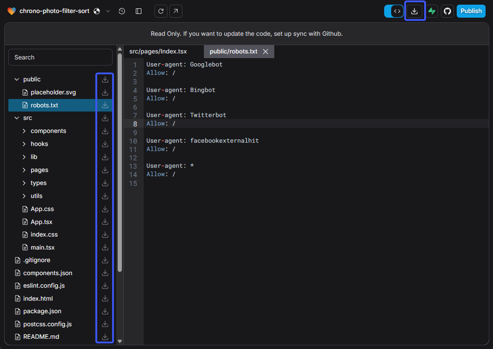
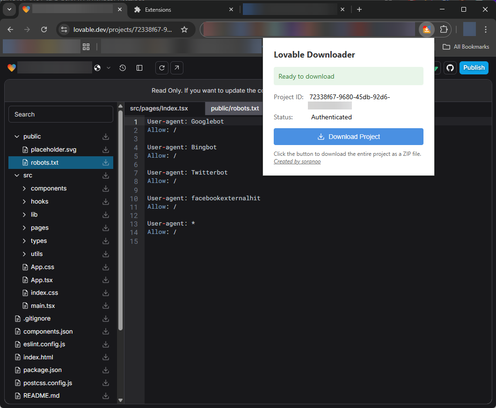
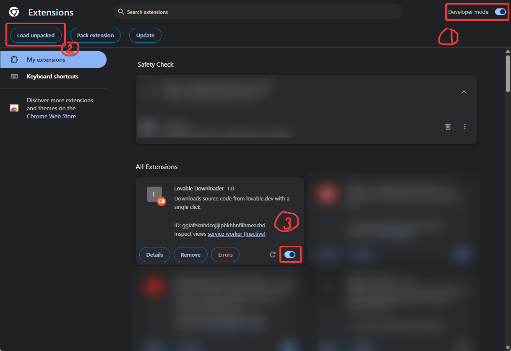

# LOVABLE-DOWNLOADER

Project starts on 14-04-2025

[](LICENSE)&nbsp;&nbsp;&nbsp;[](https://github.com/soranoo/Donation)


Wanna to download source  code from [Loveable](https://loveable.com/) but don't want to connect to GitHub or copy and paste manually?

Then this is the right place for you!

Give me a ⭐ if you like it.

## 🗝️ Features

You can download the full source code by using the download button in the top right corner.
You can also download individual files/folders by clicking on the file/folder name in the file tree.


If you are using the Chrome extension, you can also download the source code by clicking on the extension icon.


## 🚀 Getting Started

### Installation

#### Via Chrome Web Store

They rejected~.

#### Via Chrome Extension

1. Clone the repository.

   ```bash
   git clone https://github.com/soranoo/lovable-downloader.git
   ```
2. Open Chrome and go to `chrome://extensions/`.
3. Enable "Developer mode" in the top right corner.
4. Click on "Load unpacked" and select the `chrome` folder in the cloned repository.
5. Switch on the extension.

6. Reload the Loveable page.

> [!NOTE]\
> If you are logged in using 3rd party providers (eg. Google, GitHub), please check the in-page toolbar download button. The download button in the extension may not work as expected due to the inability to obtain the ID token.

#### Via Tampermonkey

1. Install [Tampermonkey](https://www.tampermonkey.net/) extension for your browser.
2. Install the script by clicking on the Tampermonkey icon in your browser and selecting "Add new script".
   Then paste the code from the [`tampermonkey/tampermonkey.js`](tampermonkey/tampermonkey.js) file into the editor and save it.
3. Switch on the script in Tampermonkey.
4. Reload the Loveable page.

## ⭐ TODO

- n/a

## 🐛 Known Issues

- n/a


## 🤝 Contributing

Contributions are welcome! If you find a bug or have a feature request, please open an issue. If you want to contribute code, please fork the repository and submit a pull request with your changes.

We are following [Conventional Commits](https://www.conventionalcommits.org/en/v1.0.0/) for commit messages.

## 📝 License

This project is licensed under the MIT License - see the [LICENSE](LICENSE) file for details

## ⭐ Star History

[](https://www.star-history.com/#soranoo/loveable-downloader&Date)

## ☕ Donation

Love it? Consider a donation to support my work.

[](https://github.com/soranoo/Donation) <- click me~
